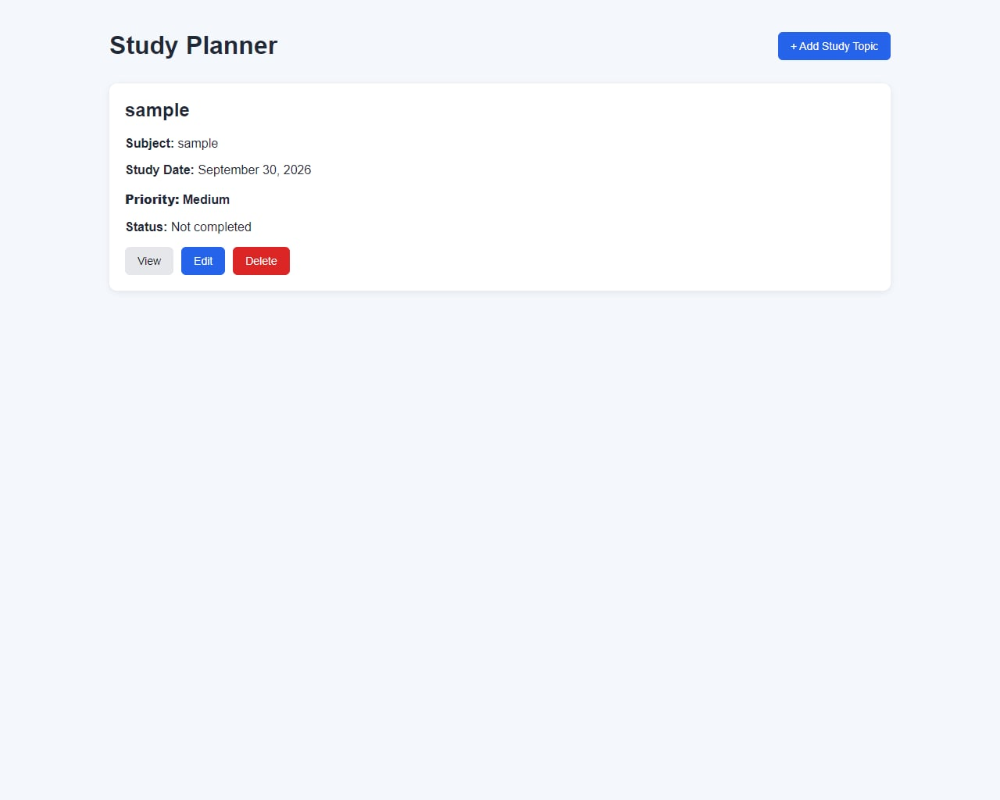
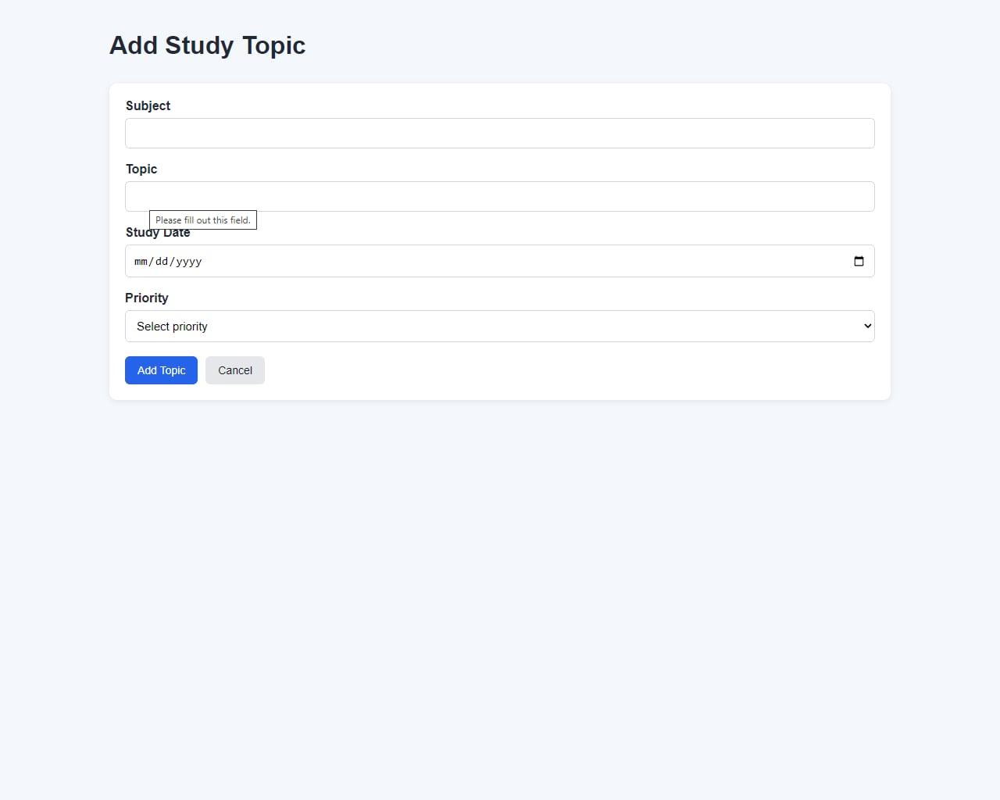
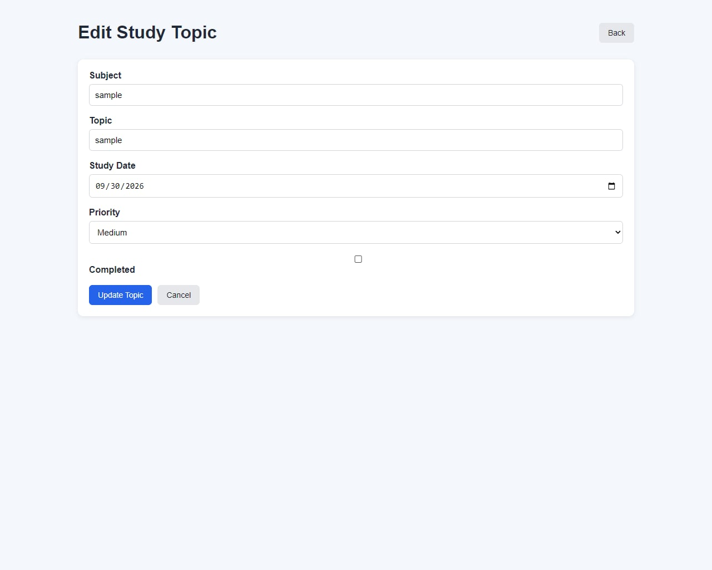
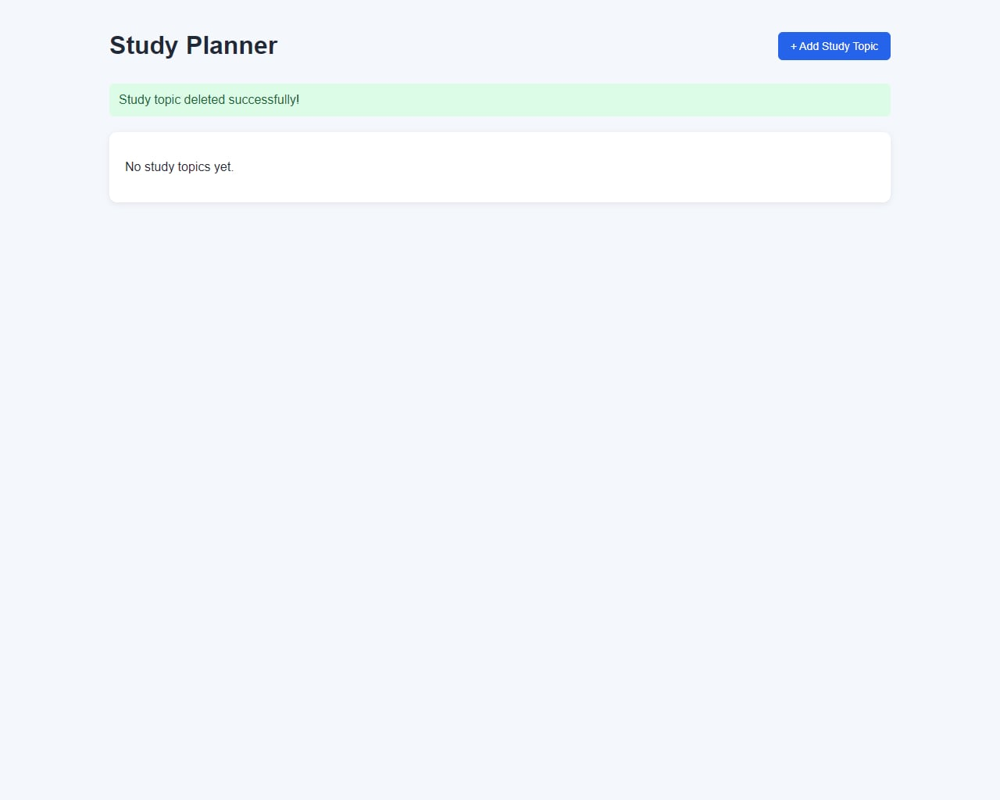

# Study Planner

A simple Laravel web application for organizing study topics and tracking study progress.

## Project Code

WST21-PM-2026-SF

## Student Name

Filford Gian Cabigas

## Course & Year

BSIT 2nd Year

## Database Used

SQLite

## Features

- Add Study Topic
- View Study Topics
- Edit Study Topics
- Delete Study Topics
- Set Study Date
- Set Priority
- Mark Topics as Completed or Not Completed

## How It Works

### 1. View Study Topics

The homepage displays all saved study topics with their subject, topic, study date, priority, and completion status.

### 2. Add a Study Topic

Click **Add Study Topic**, enter the subject, topic, study date, priority, and completion status, then save the topic.

### 3. Edit a Study Topic

Click **Edit** to change the subject, topic, study date, priority, or completion status.

### 4. Update Completion Status

You can change a study topic between **Completed** and **Not Completed** when editing.

### 5. Delete a Study Topic

Click **Delete** to remove a study topic from the planner.